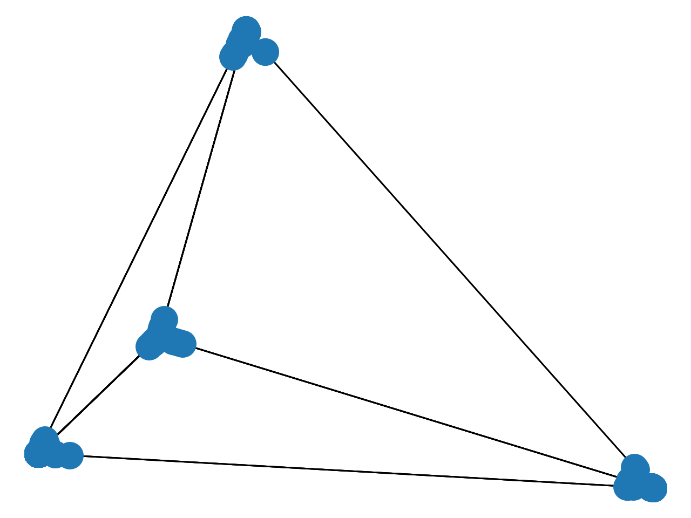

# Sentiment-Analysis-WI-Fall-19
This repository contains community detection and sentiment analysis created in the sentiment analysis part of the web intelligence (Software, MSc.) course at AAU.

<h2>Community Dectection</h2>

**The principle of Spectral clustering**

Spectral clustering is an implementation of global based clustering by graph cutting. It is based on the graph-based minimum-cut problem, where graphs are partitioned to yield the minimum cut sizes. In an unweighted graph, the size of a cut is the number of edges that are being cut. These partitions, however, can become unbalanced, hence an objective function, minimizing some objective is utilised. In this case, the objective function considers community size. We either choose to normalise the cut-size by nodes in the subgraphs (Ratio Cut) or edges in the subgraphs (Normalised Cut), which result in different objective functions. We choose to normalise by nodes, i.e. using the Ratio Cut. Ratio Cut minimisation is NP-Hard, hence Spectral Clustering is an approximation. Implementation-wise, the Ratio Cut is described by an unnormalised graph Laplacian. An unnormalised graph Laplacian is constructed by subtracting the adjacency matrix of the graph from the degree matrix of the graph. In spectral clustering we approximate the Ratio Cut problem by reformulating it as the trace-minimisation. Given the graph Laplacian the solution to the trace-minimisation problem is the eigenvectors of the graph Laplacian that corresponds to the smallest eigenvalues. However, we disregard the first eigenvector (corresponding to the minimum eigenvalue), as the corresponding eigenvector will always have constant values, which is equivalent to assigning all nodes to the same community. Instead, we use the remaining eigenvector for K-Means which is run to extract communities' memberships.

***Use of network communities in this project***

In this project the network communities are used in the process of predicting whether a user, that has not already given a review, will buy the item. According to the exercise, the predicted score is based on the average of all the user's friends' scores on that item. However, if a friend of the user is in a different community the score counts tenfold. This, I interpreted as: if a friend from a different community gives score X, it counts as if ten people gave score X.

***How many clusters perform the best?***

When plotting the network graph with a spectral layout, i.e. positioning the nodes of the graph based on the eigenvectors of the graph Laplacian, we get the graph seen on Figure 1 depicting the ratio cut.

*Figure 1: Depiction of the ratio cut for the network*

Looking, at the graph it is evident, that it consists of four very distinct communities. This also becomes evident, when computing communities for two to ten communities respectively, as seen in Table 1, which depicts the number of communities and the size of each community.

|    | 1    | 2    | 3   | 4    | 5 | 6 | 7 | 8 | 9 | 10 |
|----|------|------|-----|------|---|---|---|---|---|----|
| *2*  | 3600 | 619  |     |      |   |   |   |   |   |    |
| *4*  | 683  | 1750 | 619 | 1167 |   |   |   |   |   |    |
| *6*  | 683  | 1749 | 618 | 1167 | 1 | 1 |   |   |   |    |
| *8*  | 682  | 1749 | 617 | 1167 | 1 | 1 | 1 | 1 |   |    |
| *10* | 682  | 1747 | 617 | 1167 | 1 | 1 | 1 | 1 | 1 | 1  |

*Table 1: Comparison of number of clusters and each cluster size*

Looking at the *friendships.reviews.results.txt* it is confirmed that four communities is the right number. The results consist of four communities of the same sizes as predicted above. Therefore, we expect the use of four communities to perform the best on the data. However, when computing the accuracy, precision, and recall for the purchase predictions when using a variable number of clusters, the results remain the same, namely an accuracy of 0.98 and the precision and recall of are seen in Table 5. The reason that the values remain the same is, that the number of users with friends in a different cluster varies minimally with more clusters, since partitioning into more than four clusters results in clusters of only one person.

<h2>Sentiment Analysis</h2>

***Text pre-processing steps in sentiment analysis and considerations***

In the case of sentiment analysis typical pre-processing steps include
tokenisation, stemming, and identifying and handling linguistic
structure such as negation. 

**Tokenisation** is the act of splitting
text into its constituent parts, however it comes with some complexity,
as one must consider whether to just split on whitespace or to split at
certain characters as well, and in that case: which? Experiments show,
that sentiment-aware tokenisers perform the best, however at the cost of
being slower. Sentiment-aware meaning, that the effect of certain words,
emojis, HTML tags etc. are captured. 

**Stemming** is another
pre-processing step, where words are reduced to their word stem. This is
with the purpose of reducing the vocabulary size and treating words with
the same stem, but different endings, the same. For sentiment analysis,
stemming is not always encouraged as it might blur the sentiment
distinctions. 

**Linguistic structure** includes negation and correctly
handling this, as negating a sentiment word changes the meaning of that
word, e.g. *good* in "*good*" and "*not good*" should be treated
differently. A proposal is to append "*\_NEG*" to the words following a
negation, such that they are ultimately treated differently. This
approach has proven to perform very well. Especially, in conjunction
with a sentiment-aware tokeniser.

***Use of Naïve Bayes classifier for sentiment prediction***

The goal of the Naïve Bayes classifier (NBC) is to correctly classify a
review as either positive or negative, i.e., determining the most
probable class given a review. Performing Laplace smoothing solves the issue
where the probabilities becomes 0. This is the case, e.g. when
classifying a word that is novel to the NBC. I implement the optimisations of logspace and
Laplace smoothing.

There are two aspects of the implementation of the NBC, being 1) the
training of the classifier, and 2) the classification of new data. For
training the NBC, we use the sentiment training data and compute the probability of encountering a term given a class, and the probablity of any term occuring in a given class. These are used for
classification. For the task of training I implemented a function, which returns an object of the class *Model*, with the
necessary values initialised. This object has a method, *predict(self,
text)*, which then, for each class, computes the sum of the probability
of a term occurring in that class, plus the probability of having a
review from class, and determines which class ultimately has the highest
score.

***Use of sentiment analysis in this project.***

I trained the sentiment classifier using the training data, and then used the classifier to evaluate the reviews from the test data. I record the score that I predict each user to give fine foods based on their review. The classifier is binary, meaning I treat the scores 1-2 as negative and the scores of 4-5 as positive. Having a binary classifier implies that the strength of an opinion is not included in the computation. Having multiple classes could perform better when combining the models, however the evaluation measures might worsen because of the increased complexity. The quality of the classifier is evaluated using the measures of *accuracy*, *precision*, and *recall*. The accuracy of the sentiment classifier is 95 %, and the precision and recall are shown in Table 2.

 
  |***SCORE MEASURES***   |*Precision*  |  *Recall*
  |-----------------------|-------------|-----------
  |*Positive*             | 0.96         | 0.96
  |*Negative*             | 0.74         | 0.75

*Table 2: Evaluation measures of the sentiment classifier*

The values of the precision and recall indicates that the accuracy is
deceiving, and the sentiment model has a higher chance of labelling the
reviews positive than negative. Thus, we are more likely to say that a
user would give fine foods a high score. The reason for the sentiment
model to perform badly on the negative cases is that the training
dataset is highly skewed, with 85% being positive reviews thus only 15 %
being negative reviews. This could be accommodated for using techniques
such as k-fold cross validation or over or undersampling. With more
time, I firstly would implement k-fold cross validation. Using this
technique, I would split the data into k partitions with almost equal
numbers of positive and negative reviews in each. Then for each fold, I
would train the classifier on the remaining k-1 folds and use the
specific fold as the test set. The resulting performance of the
classifier would then be the average on the k runs of the classifier.
Using cross validation could prevent the classifier from overfitting and
improve performance on the negative cases.

***Iteratively adding features to the classifier and evaluation of this.***

Adding features iteratively is beneficial to record the effect of adding
the feature. A review is represented as a feature vector, thus adding,
or adjusting, features, revolves around how the reviews are represented
in vector form. We add or adjust features using the various
pre-processing techniques discussed previously, being tokenisation,
stemming and accounting for linguistic structure.

The results reported in Table 2 are the initial results with no features
added. Experiments are conducted when adding stemming and also when
marking negation. When using stemming we expect a decrease in the
performance of the classifier, as the meaning of some words get lost.
This is also the case, as the accuracy decreased from 95 % to 92 %.
Furthermore, the measures of precision and recall are shown in Table 3,
where all values are shown to be less than without stemming. Using
stemming also took a considerable large amount of time compared to not
using stemming, and it is therefore not deemed beneficial to include
stemmed features. When marking negation, however, we expect an increase
in accuracy. More specifically, we expect an increase in the precision
of predicting the negative cases, as explicitly marking negation should
simplify the task of recognising negative sentiment. This is, however,
not the case for my implementation, as the resulting accuracy was 91 %,
and the precision and recall are shown in Table 4. From the table, it is
seen that all values decrease, except for the recall on the negative
reviews. The improved recall shows that the number of actual negatives
the model correctly identifies is increased. The decreased precision on
the negative reviews shows that, of all the reviews predicted negative
less were actual negatives. This indicates that the classifier
classified more negative reviews than without marking negation.

  |***WITH STEMMING***   |*Precision*  |  *Recall*
  |-----------------------|-------------|-----------
  |*Positive*             | 0.95         | 0.95
  |*Negative*             | 0.72         | 0.72

*Table 3: Evaluation measures of the sentiment classifier with stemming*

  |***WITH NEGATIONG***   |*Precision*  |  *Recall*
  |-----------------------|-------------|-----------
  |*Positive*             | 0.96        | 0.93
  |*Negative*             | 0.68        | 0.79

*Table 4: Evaluation measures of the sentiment classifier with marking of
negation*

<h3>Evaluation on prediction of whether users, who have not given a review would buy fine foods from Amazon when integrating community dectection and sentiment analysis.</h3>

When integrating the implementation of sentiment analysis and community
detection we want to predict whether users, that have not already given
a review, are likely to want to purchase fine food from Amazon. To do
this, then for each user we compute the average score of the reviews
their friends have given - if they have given any. Furthermore, if the
friend is Kyle or the friend is from a different community that person's
opinion counts tenfold. It is assumed, that if the friend is *both* Kyle
and from a different community, the score still just counts tenfold. If
the average score is rounded to 1, we predict that the user *will*
purchase fine foods, and if it is rounded to 0, we predict that the user
will not. This is because 1 indicates positive and 0 indicates negative.
The predictions are evaluated against the ground truth given in the test
set. Similarly, to how the score measures computed above, we evaluate on
accuracy, precision, recall. The accuracy for predicting whether a user
would purchase an item is 98%. The precision and recall measures are
seen in Table 3.

  |***WOULD PURCHASE MEASURES***   |*Precision*  |  *Recall*
  |-----------------------|-------------|-----------
  |*Positive*             | 0.99         | 0.98
  |*Negative*             | 0.71         | 0.89

*Table 5: Evaluation measures of the prediction of users are willing to
buy fine foods from Amazon*

The results show similar tendencies as the results on the score
predictions. This means, that both the precision and the recall are very
high on the positive cases, but low on the negative cases. This is a
direct result of the fact that the sentiment classifier performs poorly
due to the skewed data.
